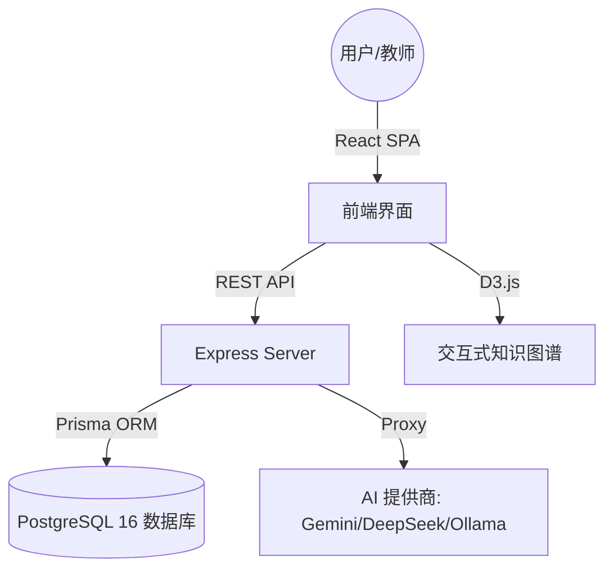

# 🎓 Future Learning 系统分析报告

## 1. 核心架构概述
本系统是一个由 AI 驱动的“认知图谱”学习平台。它通过将非结构化文档（PDF、文本）转化为可视化的知识图谱（Knowledge Graph），帮助用户更高效地理解知识体系。

### 技术架构图

---

## 2. 技术栈详情

### 前端 (Frontend)
- **核心框架**: React 19 + TypeScript
- **构建工具**: Vite
- **可视化库**: **D3.js** (用于渲染力导向图 `ForceGraph.tsx`)
- **UI 框架**: Tailwind CSS + Lucide React (图标)
- **文档处理**: `pdf-dist` (PDF 解析)

### 后端 (Backend)
- **环境**: Node.js + Express
- **数据库**: PostgreSQL 16 (基于 Prisma ORM 托管，使用连接池增强并发)
- **文件处理**: Multer (支持大文件和视频上传)
- **架构模式**: 代理模式 (Proxy API 用于整合多种 AI 模型)

---

## 3. 核心功能解析

### 🔥 智能课程生成
- **流程**: 用户上传 PDF 或输入长文本 -> 前端解析 -> 后端调用 AI 提取关键实体和逻辑关系 -> 生成 `graphData`。
- **存储**: 课程数据以 JSON 格式存储 in `courses` 表的 `graphData` 字段中。

### 🛡️ 完善的权限系统 (RBAC)
- **角色分配**:
  - `admin`: 系统管理，可修改全局 AI 配置，管理所有用户。
  - `teacher`: 课程创作，可管理自己拥有权限的课程。
  - `student`: 课程学习，可查看已发布的课程。
- **协作模式**: 支持 `course_permissions` 表，允许将一门课程的编辑权授予多位教师。

### 🧠 AI 助手集成
- **多模型支持**: 系统预置了对 DeepSeek, Zhipu (智谱AI), Ollama (本地), Qwen (通义千问), 和 Gemini 的支持。
- **缓存机制**: 通过 `content_cache` 表缓存 AI 生成的讲解内容，减少 API 调用开销，提升加载速度。

---

## 4. 关键文件分析

| 文件名 | 职责描述 |
| :--- | :--- |
| [App.tsx](file:///e:/fl1202/App.tsx) | 前端全局路由与状态管理，控制身份验证流程。 |
| [server.js](file:///e:/fl1202/server/server.js) | 后端主逻辑，包含数据库初始化、API 路由、AI 代理及权限拦截。 |
| [storageService.ts](file:///e:/fl1202/services/storageService.ts) | 封装了所有网络请求，并包含匿名身份生成的安全逻辑。 |
| [ForceGraph.tsx](file:///e:/fl1202/components/ForceGraph.tsx) | 系统的“灵魂”组件，利用 D3 处理大规模知识点的布局与交互。 |

---

## 5. 数据库设计要点
- **`settings` 表**: 唯一的单行表，用于持久化系统级的 API 配置。
- **`courses` 表**: 包含 `status` 字段（`draft`, `published`, `hidden`），精细控制课程可见性。
- **`isAnonymous`**: 用户表中的此字段允许系统在无需注册的情况下为学生保留学习进度。

---
> [!NOTE]
> 该系统目前处于高度可扩展状态。后端已预留了多租户和多 AI 协作的接口，前端使用 Vite 代理完美解决了跨域和防火墙限制问题。
